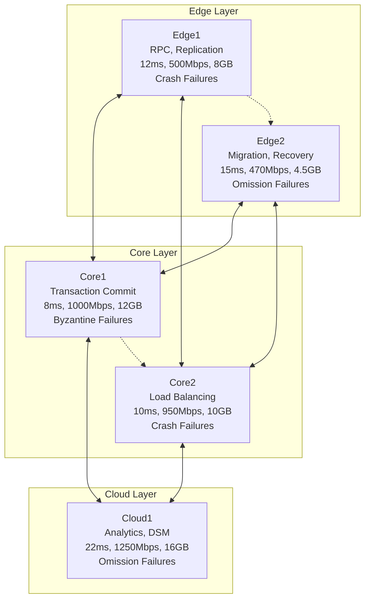

# Distributed Telecom System

[](https://www.oracle.com/java/)
[](https://www.python.org/)
[](https://maven.apache.org/)
[](https://react.dev/)
[](LICENSE)

A carrier-grade edge-core-cloud distributed telecom system implementing advanced fault tolerance, load balancing, transaction management, and performance optimization across heterogeneous nodes.

## Overview

This project implements a comprehensive distributed telecom system that interconnects five heterogeneous nodes across three architectural layers (Edge, Core, Cloud). The system is designed to handle diverse failure modes (crash, omission, Byzantine), optimize performance across multiple dimensions, and provide strong consistency guarantees under concurrent operations.

### Key Features

- **Multi-Layer Architecture**: Edge-Core-Cloud topology with optimized service placement
- **Advanced Fault Tolerance**: Handles crash, omission, and Byzantine failures with automated recovery
- **Dynamic Load Balancing**: Resource-aware allocation with adaptive migration
- **Distributed Transactions**: 2PC/3PC protocols with deadlock detection and resolution
- **Performance Optimization**: Real-time bottleneck analysis and throughput maximization
- **Redundancy & Failover**: Risk-based replication strategies with automated failover
- **Property-Based Testing**: Comprehensive validation using QuickCheck for Java
- **Real-Time Dashboard**: React-based monitoring UI with live metrics visualization

## Architecture

### System Topology



### Node Characteristics

| Node   | Layer | Latency | Throughput | CPU    | Memory | Tx/sec | Failure Type |
|--------|-------|---------|------------|--------|--------|--------|--------------|
| Edge1  | Edge  | 12ms    | 500 Mbps   | 45%    | 8.0GB  | 150    | Crash        |
| Edge2  | Edge  | 15ms    | 470 Mbps   | 50%    | 4.5GB  | 100    | Omission     |
| Core1  | Core  | 8ms     | 1000 Mbps  | 60%    | 12.0GB | 250    | Byzantine    |
| Core2  | Core  | 10ms    | 950 Mbps   | 55%    | 10.0GB | 200    | Crash        |
| Cloud1 | Cloud | 22ms    | 1250 Mbps  | 72%    | 16.0GB | 300    | Omission     |

## Quick Start

### Prerequisites

- Java 11 or higher
- Maven 3.6 or higher
- Python 3.8 or higher
- Node.js 18+ (for dashboard)
- Git

### Installation

1. Clone the repository
   ```bash
   git clone https://github.com/yourusername/distributed-telecom-system.git
   cd distributed-telecom-system
   ```

2. Build the Java components
   ```bash
   mvn clean install
   ```

3. Install Python dependencies
   ```bash
   cd python_simulation
   pip install -r requirements.txt
   ```

4. Install Dashboard dependencies (optional)
   ```bash
   cd dashboard
   npm install
   ```

### Running the System

The easiest way to build and run everything is using the provided scripts:

#### Windows

```cmd
start.bat
```

Double-click the file or run it from Command Prompt. The script will:
1. Clean previous builds
2. Build the Java project
3. Run Java tests
4. Run the Python simulation
5. Build the Dashboard (if Node.js is available)

#### Linux / macOS

```bash
./build.sh
```

Make sure the script is executable first:
```bash
chmod +x build.sh
```

#### Manual Execution

If you prefer to run components individually:

**Java System**
```bash
# Build the project
mvn clean install

# Run tests
mvn test

# Run property-based tests
mvn test -Dtest="*PropertyTest"
```

**Python Simulation**
```bash
cd python_simulation

# Run load balancing simulation
python3 demo.py

# Run redundancy and failover demo
python3 redundancy_demo.py

# Run all tests
python3 run_tests.py
```

**Dashboard (React UI)**
```bash
cd dashboard

# Install dependencies
npm install

# Run in development mode (with mock data)
npm run dev

# For live data, also start the backend:
cd backend
pip install -r requirements.txt
python main.py
```

The dashboard will be available at http://localhost:5173

## Dashboard

The real-time monitoring dashboard provides visualization of the distributed telecom system.

### Features

- **Node Status**: Live status cards for all 5 nodes (Edge1, Edge2, Core1, Core2, Cloud1)
- **System Topology**: Interactive visualization of the 3-tier architecture
- **Metrics Charts**: CPU, Memory, and Latency bar charts
- **Load Balance Gauge**: Real-time load distribution index
- **Transaction Monitor**: Recent transactions with status tracking
- **Failover Events**: Fault tolerance and recovery event log
- **Dark/Light Mode**: Theme toggle support

### Running the Dashboard

**Demo Mode (no backend required):**
```bash
cd dashboard
npm install
npm run dev
```

**With Live Data:**
```bash
# Terminal 1: Start the FastAPI backend
cd dashboard/backend
pip install -r requirements.txt
python main.py

# Terminal 2: Start the React frontend
cd dashboard
npm run dev
```

Open http://localhost:5173 in your browser.

### Dashboard API Endpoints

| Endpoint | Method | Description |
|----------|--------|-------------|
| `/api/metrics` | GET | Current system metrics for all nodes |
| `/api/nodes/{id}` | GET | Specific node details |
| `/api/transactions` | GET | Recent transaction list |
| `/api/failover-events` | GET | Recent failover events |
| `/api/simulation/start` | POST | Start the simulation |
| `/api/simulation/stop` | POST | Stop the simulation |
| `/ws/metrics` | WebSocket | Real-time metrics stream |

## Core Components

### Java Components

- **DistributedTelecomSystem**: Main orchestrator integrating all system components
- **NodeManager**: Manages individual node lifecycle and metrics
- **CommunicationManager**: Handles inter-node RPC and messaging
- **TransactionManager**: Implements 2PC/3PC distributed transaction protocols
- **FaultToleranceManager**: Detects and recovers from various failure types
- **LoadBalancer**: Dynamic resource-aware load distribution
- **ReplicationManager**: Data replication and migration strategies
- **PerformanceAnalyzer**: Real-time bottleneck identification and ranking
- **SystemOptimizer**: Multi-objective performance optimization

### Python Components

- **LoadBalancerSimulation**: Dynamic load balancing with failure injection
- **RedundancyFailoverManager**: Risk-based redundancy and automated failover
- **FailureInjector**: Simulates crash, omission, and Byzantine failures
- **NetworkDelaySimulator**: Realistic network latency and jitter simulation
- **AdaptiveMigrationEngine**: Intelligent service migration decisions

### Dashboard Components

- **Frontend**: React 18 + TypeScript + Tailwind CSS v4 + shadcn/ui design system
- **Backend**: FastAPI with WebSocket support for real-time updates
- **Charts**: Recharts for data visualization
- **State**: Custom hooks with automatic polling and WebSocket fallback

## Testing

The system employs a dual testing approach:

### Unit Testing
- Specific scenarios with known inputs/outputs
- Edge case validation
- Component integration testing

### Property-Based Testing
- 30 universal properties validated across all inputs
- Automated test case generation
- Regression prevention

Run all tests:
```bash
# Java tests
mvn test

# Python tests
cd python_simulation
python3 run_tests.py
```

## Performance Metrics

The system tracks and optimizes:

- **Latency**: 8-22ms range across nodes
- **Throughput**: 470-1250 Mbps capacity
- **CPU Utilization**: 45-72% operational range
- **Memory Usage**: 4.0-16.0 GB per node
- **Transaction Rate**: 100-300 tx/sec
- **Lock Contention**: 5-15% typical range

## Configuration

System configuration is managed through:

- **Java**: `SystemConfiguration` class with node-specific settings
- **Python**: `SimulationConfig` dataclass for simulation parameters

Example configuration:
```java
SystemConfiguration config = new SystemConfiguration.Builder()
    .withMaxConcurrentTransactions(1000)
    .withTransactionTimeout(5000)
    .withHealthCheckInterval(1000)
    .build();
```

## Documentation

- **[DOCUMENTATION.md](docs/DOCUMENTATION.md)**: Comprehensive technical documentation with detailed architecture, algorithms, and implementation details
- **[Dashboard README](dashboard/README.md)**: Dashboard setup and development guide
- **[Requirements](docs/requirements.md)**: Complete requirements specification
- **[Design](docs/design.md)**: System design and architecture

## Contributing

Contributions are welcome! Please follow these guidelines:

1. Fork the repository
2. Create a feature branch (`git checkout -b feature/amazing-feature`)
3. Commit your changes (`git commit -m 'Add amazing feature'`)
4. Push to the branch (`git push origin feature/amazing-feature`)
5. Open a Pull Request

## License

This project is licensed under the MIT License - see the [LICENSE](LICENSE) file for details.

## Acknowledgments

- Inspired by carrier-grade telecom systems
- Built with modern distributed systems principles
- Implements formal verification and property-based testing methodologies

## Contact

For questions or support, please open an issue on GitHub.

---

Built for distributed systems excellence
