# Distributed Telecom System - Technical Documentation

## Table of Contents

1. [System Overview](#system-overview)
2. [Architecture](#architecture)
3. [Core Components](#core-components)
4. [Data Flow](#data-flow)
5. [Fault Tolerance](#fault-tolerance)
6. [Performance Optimization](#performance-optimization)
7. [Transaction Management](#transaction-management)
8. [Load Balancing](#load-balancing)
9. [Replication & Migration](#replication--migration)
10. [Testing Strategy](#testing-strategy)
11. [Algorithms & Implementation](#algorithms--implementation)
12. [Deployment & Operations](#deployment--operations)

---

## System Overview

### Introduction

The Distributed Telecom System is a carrier-grade edge-core-cloud architecture designed to provide high availability, fault tolerance, and optimal performance across heterogeneous nodes. The system handles diverse failure modes, optimizes resource utilization, and maintains strong consistency guarantees under concurrent operations.

### Design Philosophy

The system is built on four core principles:

1. **Formal Optimization**: All design decisions are backed by mathematical analysis and formal reasoning
2. **Fault Tolerance First**: System designed to handle crash, omission, and Byzantine failures gracefully
3. **Performance-Driven**: Real-time bottleneck analysis and adaptive optimization
4. **Property-Based Validation**: Universal correctness properties verified across all inputs

### System Capabilities

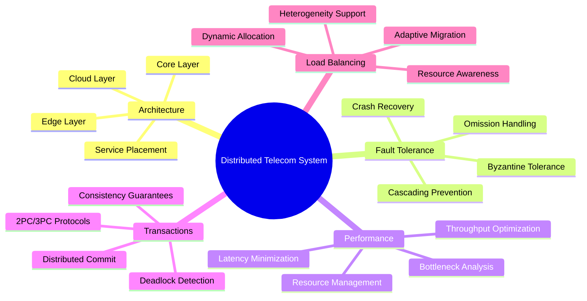
```mermaid
mindmap
  root((Distributed Telecom System))
    Architecture
      Edge Layer
      Core Layer
      Cloud Layer
      Service Placement
    Fault Tolerance
      Crash Recovery
      Omission Handling
      Byzantine Tolerance
      Cascading Prevention
    Performance
      Bottleneck Analysis
      Throughput Optimization
      Latency Minimization
      Resource Management
    Transactions
      2PC/3PC Protocols
      Deadlock Detection
      Distributed Commit
      Consistency Guarantees
    Load Balancing
      Dynamic Allocation
      Adaptive Migration
      Resource Awareness
      Heterogeneity Support
```

---

## Architecture

### Three-Tier Topology

The system implements a hierarchical three-tier architecture optimized for telecom workloads:

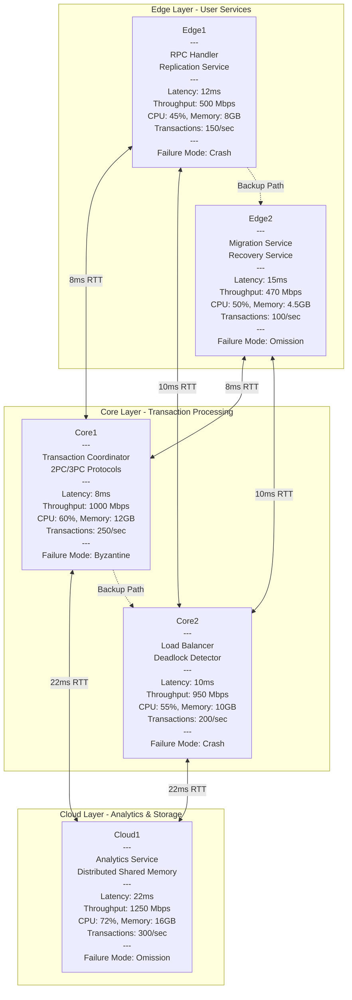
```mermaid
graph TB
    subgraph Cloud["Cloud Layer - Analytics & Storage"]
        Cloud1["Cloud1<br/>---<br/>Analytics Service<br/>Distributed Shared Memory<br/>---<br/>Latency: 22ms<br/>Throughput: 1250 Mbps<br/>CPU: 72%, Memory: 16GB<br/>Transactions: 300/sec<br/>---<br/>Failure Mode: Omission"]
    end
    
    subgraph Core["Core Layer - Transaction Processing"]
        Core1["Core1<br/>---<br/>Transaction Coordinator<br/>2PC/3PC Protocols<br/>---<br/>Latency: 8ms<br/>Throughput: 1000 Mbps<br/>CPU: 60%, Memory: 12GB<br/>Transactions: 250/sec<br/>---<br/>Failure Mode: Byzantine"]
        Core2["Core2<br/>---<br/>Load Balancer<br/>Deadlock Detector<br/>---<br/>Latency: 10ms<br/>Throughput: 950 Mbps<br/>CPU: 55%, Memory: 10GB<br/>Transactions: 200/sec<br/>---<br/>Failure Mode: Crash"]
    end
    
    subgraph Edge["Edge Layer - User Services"]
        Edge1["Edge1<br/>---<br/>RPC Handler<br/>Replication Service<br/>---<br/>Latency: 12ms<br/>Throughput: 500 Mbps<br/>CPU: 45%, Memory: 8GB<br/>Transactions: 150/sec<br/>---<br/>Failure Mode: Crash"]
        Edge2["Edge2<br/>---<br/>Migration Service<br/>Recovery Service<br/>---<br/>Latency: 15ms<br/>Throughput: 470 Mbps<br/>CPU: 50%, Memory: 4.5GB<br/>Transactions: 100/sec<br/>---<br/>Failure Mode: Omission"]
    end
    
    Edge1 <-->|8ms RTT| Core1
    Edge1 <-->|10ms RTT| Core2
    Edge2 <-->|8ms RTT| Core1
    Edge2 <-->|10ms RTT| Core2
    Core1 <-->|22ms RTT| Cloud1
    Core2 <-->|22ms RTT| Cloud1
    Edge1 -.->|Backup Path| Edge2
    Core1 -.->|Backup Path| Core2
```


### Service Placement Strategy

Service placement is optimized based on formal criteria:

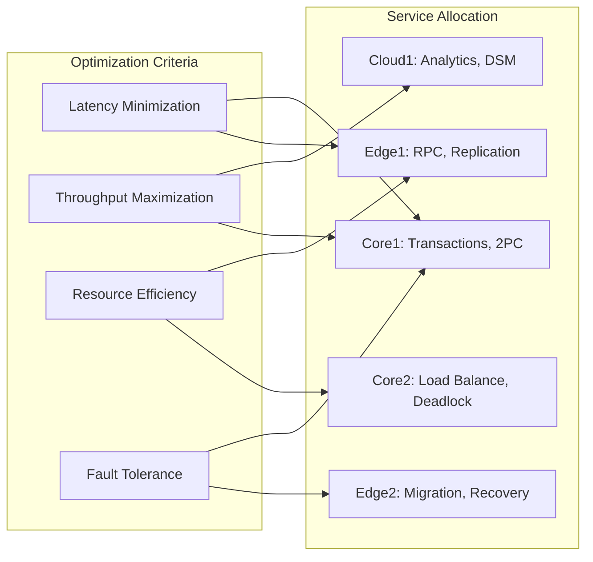
```mermaid
graph LR
    subgraph Criteria["Optimization Criteria"]
        A[Latency Minimization]
        B[Throughput Maximization]
        C[Resource Efficiency]
        D[Fault Tolerance]
    end
    
    subgraph Allocation["Service Allocation"]
        E1[Edge1: RPC, Replication]
        E2[Edge2: Migration, Recovery]
        C1[Core1: Transactions, 2PC]
        C2[Core2: Load Balance, Deadlock]
        CL[Cloud1: Analytics, DSM]
    end
    
    A --> E1
    B --> C1
    C --> C2
    D --> E2
    A --> C1
    B --> CL
    C --> E1
    D --> C1
```

### Network Topology & Communication Paths

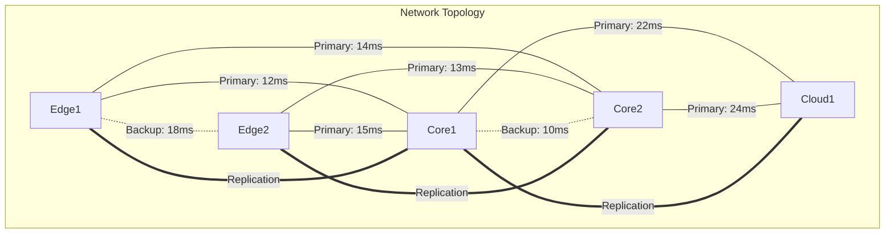
```mermaid
graph TD
    subgraph Network["Network Topology"]
        E1[Edge1]
        E2[Edge2]
        C1[Core1]
        C2[Core2]
        CL[Cloud1]
        
        E1 ---|Primary: 12ms| C1
        E1 ---|Primary: 14ms| C2
        E2 ---|Primary: 15ms| C1
        E2 ---|Primary: 13ms| C2
        C1 ---|Primary: 22ms| CL
        C2 ---|Primary: 24ms| CL
        E1 -.-|Backup: 18ms| E2
        C1 -.-|Backup: 10ms| C2
        E1 ===|Replication| C1
        E2 ===|Replication| C2
        C1 ===|Replication| CL
    end
```

---

## Core Components

### Component Architecture

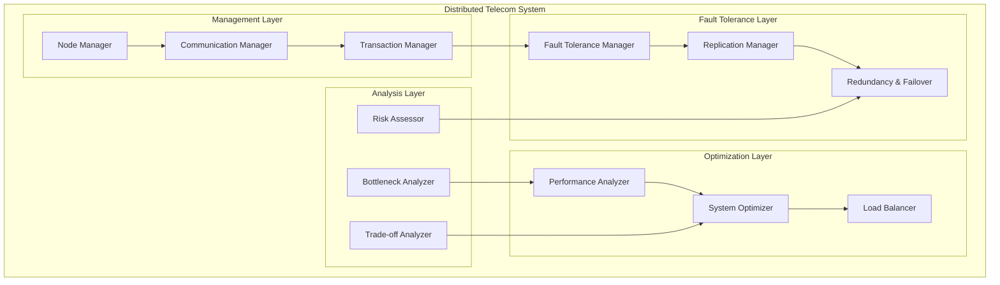
```mermaid
graph TB
    subgraph System["Distributed Telecom System"]
        subgraph Management["Management Layer"]
            NM[Node Manager]
            CM[Communication Manager]
            TM[Transaction Manager]
        end
        
        subgraph FaultTolerance["Fault Tolerance Layer"]
            FTM[Fault Tolerance Manager]
            RM[Replication Manager]
            RFM[Redundancy & Failover]
        end
        
        subgraph Optimization["Optimization Layer"]
            PA[Performance Analyzer]
            SO[System Optimizer]
            LB[Load Balancer]
        end
        
        subgraph Analysis["Analysis Layer"]
            BA[Bottleneck Analyzer]
            RA[Risk Assessor]
            TA[Trade-off Analyzer]
        end
    end
    
    NM --> CM
    CM --> TM
    TM --> FTM
    FTM --> RM
    RM --> RFM
    PA --> SO
    SO --> LB
    BA --> PA
    RA --> RFM
    TA --> SO
```

### Node Manager

Manages individual node lifecycle, health monitoring, and metrics collection.

**Key Responsibilities:**
- Node initialization and configuration
- Real-time metrics collection
- Health status monitoring
- Resource utilization tracking
- Failure detection

**Metrics Tracked:**

| Metric | Range | Description |
|--------|-------|-------------|
| Latency | 8-22ms | Round-trip time for requests |
| Throughput | 470-1250 Mbps | Network bandwidth capacity |
| CPU Utilization | 45-72% | Processor usage percentage |
| Memory Usage | 4.0-16.0 GB | RAM consumption |
| Transactions/sec | 100-300 | Transaction processing rate |
| Lock Contention | 5-15% | Resource lock conflicts |
| Packet Loss | 0-5% | Network packet drop rate |


### Communication Manager

Handles all inter-node communication with support for RPC, message passing, and event ordering.

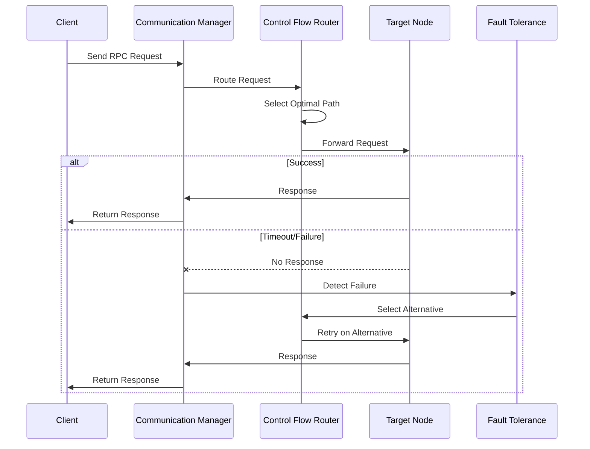
```mermaid
sequenceDiagram
    participant Client
    participant CM as Communication Manager
    participant Router as Control Flow Router
    participant Target as Target Node
    participant FT as Fault Tolerance
    
    Client->>CM: Send RPC Request
    CM->>Router: Route Request
    Router->>Router: Select Optimal Path
    Router->>Target: Forward Request
    
    alt Success
        Target->>CM: Response
        CM->>Client: Return Response
    else Timeout/Failure
        Target--xCM: No Response
        CM->>FT: Detect Failure
        FT->>Router: Select Alternative
        Router->>Target: Retry on Alternative
        Target->>CM: Response
        CM->>Client: Return Response
    end
```

**Features:**
- Asynchronous RPC with timeout and retry
- Priority-based message queuing
- Event ordering with causal consistency
- Network partition detection
- Automatic failover routing

### Transaction Manager

Implements distributed transaction protocols (2PC/3PC) with deadlock detection.

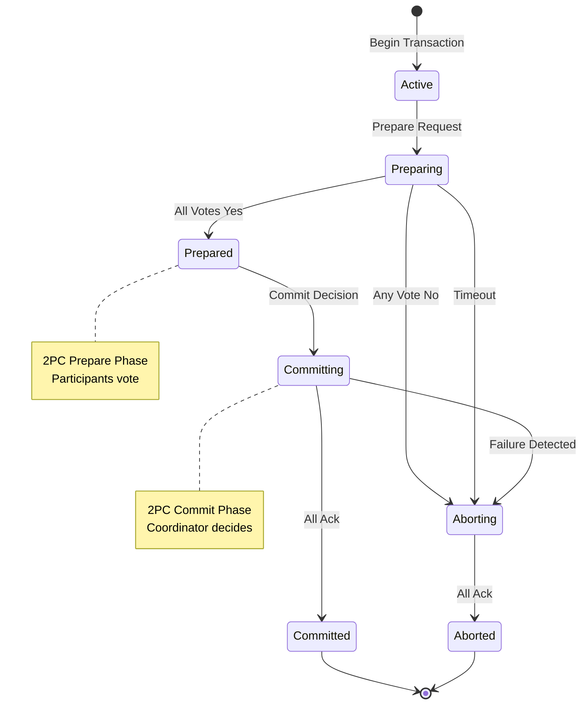
```mermaid
stateDiagram-v2
    [*] --> Active: Begin Transaction
    Active --> Preparing: Prepare Request
    Preparing --> Prepared: All Votes Yes
    Preparing --> Aborting: Any Vote No
    Prepared --> Committing: Commit Decision
    Committing --> Committed: All Ack
    Aborting --> Aborted: All Ack
    Committed --> [*]
    Aborted --> [*]
    
    Preparing --> Aborting: Timeout
    Committing --> Aborting: Failure Detected
    
    note right of Prepared
        2PC Prepare Phase
        Participants vote
    end note
    
    note right of Committing
        2PC Commit Phase
        Coordinator decides
    end note
```

**Transaction Lifecycle:**

1. **Active**: Transaction initiated, operations in progress
2. **Preparing**: Coordinator sends prepare requests to all participants
3. **Prepared**: All participants voted YES and are ready to commit
4. **Committing**: Coordinator sends commit decision
5. **Committed**: Transaction successfully committed on all nodes
6. **Aborting**: Transaction being rolled back
7. **Aborted**: Transaction fully rolled back

---

## Data Flow

### End-to-End Request Processing

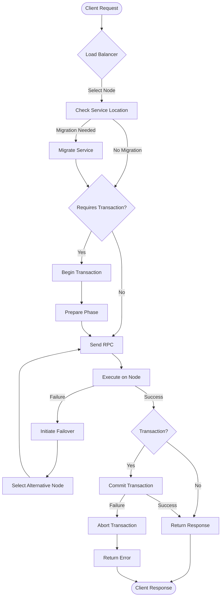
```mermaid
flowchart TD
    Start([Client Request]) --> LB{Load Balancer}
    LB -->|Select Node| Check[Check Service Location]
    Check -->|Migration Needed| Migrate[Migrate Service]
    Check -->|No Migration| TX{Requires Transaction?}
    Migrate --> TX
    
    TX -->|Yes| BeginTX[Begin Transaction]
    TX -->|No| SendRPC[Send RPC]
    BeginTX --> Prepare[Prepare Phase]
    Prepare --> SendRPC
    
    SendRPC --> Execute[Execute on Node]
    Execute -->|Success| TXCommit{Transaction?}
    Execute -->|Failure| Failover[Initiate Failover]
    
    Failover --> Alternative[Select Alternative Node]
    Alternative --> SendRPC
    
    TXCommit -->|Yes| Commit[Commit Transaction]
    TXCommit -->|No| Response[Return Response]
    Commit -->|Success| Response
    Commit -->|Failure| Abort[Abort Transaction]
    Abort --> Error[Return Error]
    
    Response --> End([Client Response])
    Error --> End
```


### Service Request Flow with Timing


```mermaid
gantt
    title Request Processing Timeline (Typical 70ms End-to-End)
    dateFormat X
    axisFormat %L ms
    
    section Edge Layer
    RPC Request Received    :0, 12
    
    section Core Layer
    Transaction Coordination :12, 20
    Prepare Phase           :20, 28
    
    section Cloud Layer
    Analytics Processing    :28, 50
    
    section Core Layer
    Commit Phase           :50, 60
    
    section Edge Layer
    Response Delivery      :60, 70
```

### Data Replication Flow

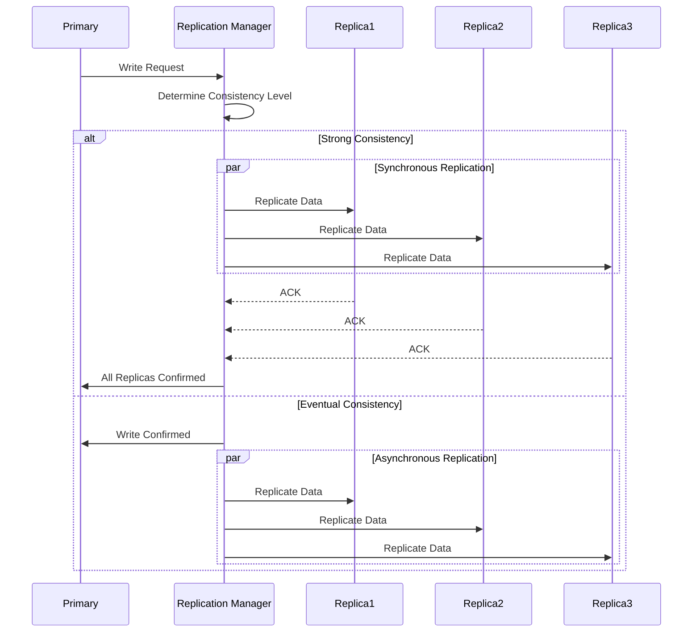
```mermaid
sequenceDiagram
    participant Primary
    participant RM as Replication Manager
    participant Replica1
    participant Replica2
    participant Replica3
    
    Primary->>RM: Write Request
    RM->>RM: Determine Consistency Level
    
    alt Strong Consistency
        par Synchronous Replication
            RM->>Replica1: Replicate Data
            RM->>Replica2: Replicate Data
            RM->>Replica3: Replicate Data
        end
        Replica1-->>RM: ACK
        Replica2-->>RM: ACK
        Replica3-->>RM: ACK
        RM->>Primary: All Replicas Confirmed
    else Eventual Consistency
        RM->>Primary: Write Confirmed
        par Asynchronous Replication
            RM->>Replica1: Replicate Data
            RM->>Replica2: Replicate Data
            RM->>Replica3: Replicate Data
        end
    end
```

---

## Fault Tolerance

### Failure Type Handling

The system handles three distinct failure modes:

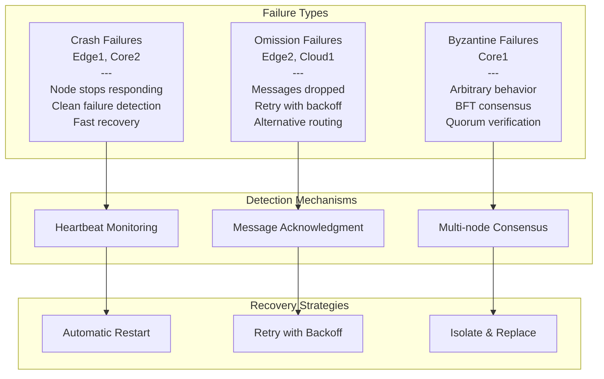
```mermaid

graph TB
    subgraph Failures["Failure Types"]
        Crash["Crash Failures<br/>Edge1, Core2<br/>---<br/>Node stops responding<br/>Clean failure detection<br/>Fast recovery"]
        Omission["Omission Failures<br/>Edge2, Cloud1<br/>---<br/>Messages dropped<br/>Retry with backoff<br/>Alternative routing"]
        Byzantine["Byzantine Failures<br/>Core1<br/>---<br/>Arbitrary behavior<br/>BFT consensus<br/>Quorum verification"]
    end
    
    subgraph Detection["Detection Mechanisms"]
        HB[Heartbeat Monitoring]
        ACK[Message Acknowledgment]
        Consensus[Multi-node Consensus]
    end
    
    subgraph Recovery["Recovery Strategies"]
        Restart[Automatic Restart]
        Retry[Retry with Backoff]
        Isolate[Isolate & Replace]
    end
    
    Crash --> HB --> Restart
    Omission --> ACK --> Retry
    Byzantine --> Consensus --> Isolate
```

### Cascading Failure Prevention

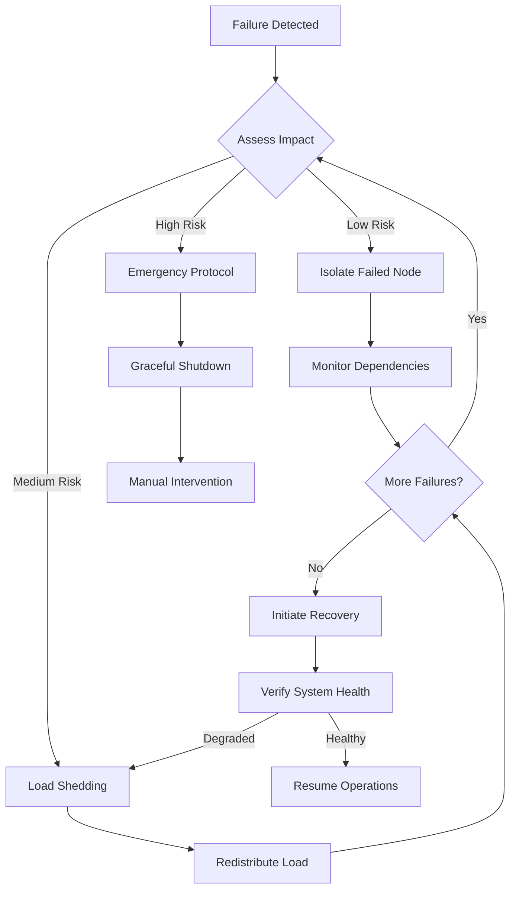
```mermaid

flowchart TD
    Detect[Failure Detected] --> Assess{Assess Impact}
    Assess -->|Low Risk| Isolate[Isolate Failed Node]
    Assess -->|Medium Risk| LoadShed[Load Shedding]
    Assess -->|High Risk| Emergency[Emergency Protocol]
    
    Isolate --> Monitor[Monitor Dependencies]
    LoadShed --> Redistribute[Redistribute Load]
    Emergency --> Shutdown[Graceful Shutdown]
    
    Monitor --> Check{More Failures?}
    Redistribute --> Check
    Shutdown --> Manual[Manual Intervention]
    
    Check -->|No| Recover[Initiate Recovery]
    Check -->|Yes| Assess
    
    Recover --> Verify[Verify System Health]
    Verify -->|Healthy| Resume[Resume Operations]
    Verify -->|Degraded| LoadShed
```


### Fault Tolerance Metrics

| Metric | Target | Description |
|--------|--------|-------------|
| Mean Time Between Failures (MTBF) | 720 hours | Average time between system failures |
| Mean Time To Recovery (MTTR) | 30 seconds | Average time to recover from failure |
| System Availability | 99.99% | Percentage of uptime |
| Recovery Time Objective (RTO) | 60 seconds | Maximum acceptable recovery time |
| Recovery Point Objective (RPO) | 5 seconds | Maximum acceptable data loss |

### Redundancy & Failover Architecture

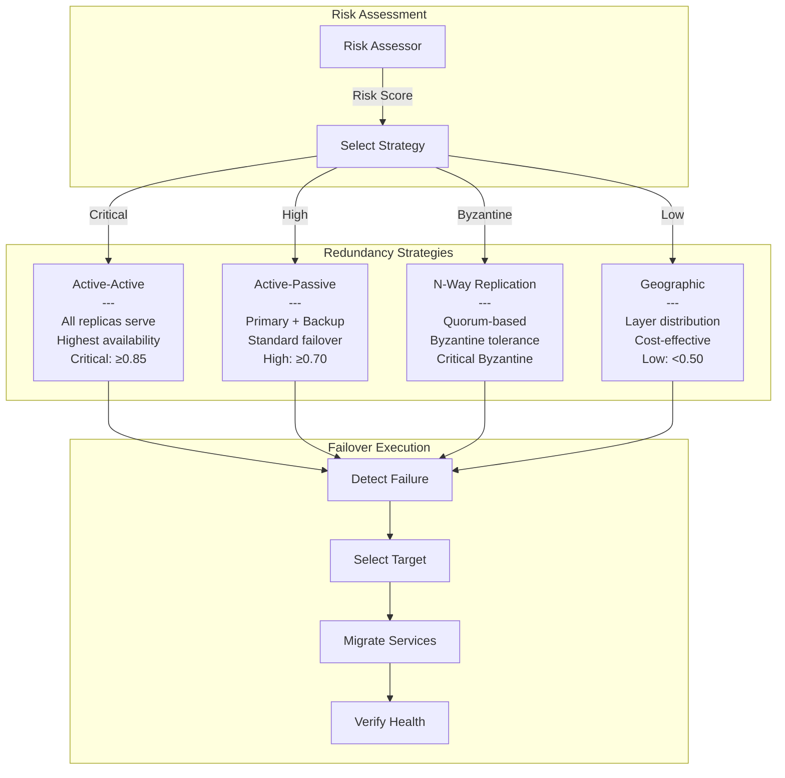
```mermaid

graph TB
    subgraph Risk_Assessment["Risk Assessment"]
        RA[Risk Assessor]
        RA -->|Risk Score| Strategy[Select Strategy]
    end
    
    subgraph Redundancy_Strategies["Redundancy Strategies"]
        AA["Active-Active<br/>---<br/>All replicas serve<br/>Highest availability<br/>Critical: ≥0.85"]
        AP["Active-Passive<br/>---<br/>Primary + Backup<br/>Standard failover<br/>High: ≥0.70"]
        NWay["N-Way Replication<br/>---<br/>Quorum-based<br/>Byzantine tolerance<br/>Critical Byzantine"]
        Geo["Geographic<br/>---<br/>Layer distribution<br/>Cost-effective<br/>Low: <0.50"]
    end
    
    subgraph Failover["Failover Execution"]
        Detect[Detect Failure]
        Select[Select Target]
        Migrate[Migrate Services]
        Verify[Verify Health]
    end
    
    Strategy -->|Critical| AA
    Strategy -->|High| AP
    Strategy -->|Byzantine| NWay
    Strategy -->|Low| Geo
    
    AA --> Detect
    AP --> Detect
    NWay --> Detect
    Geo --> Detect
    
    Detect --> Select
    Select --> Migrate
    Migrate --> Verify
```

### Multi-Node Failure Handling

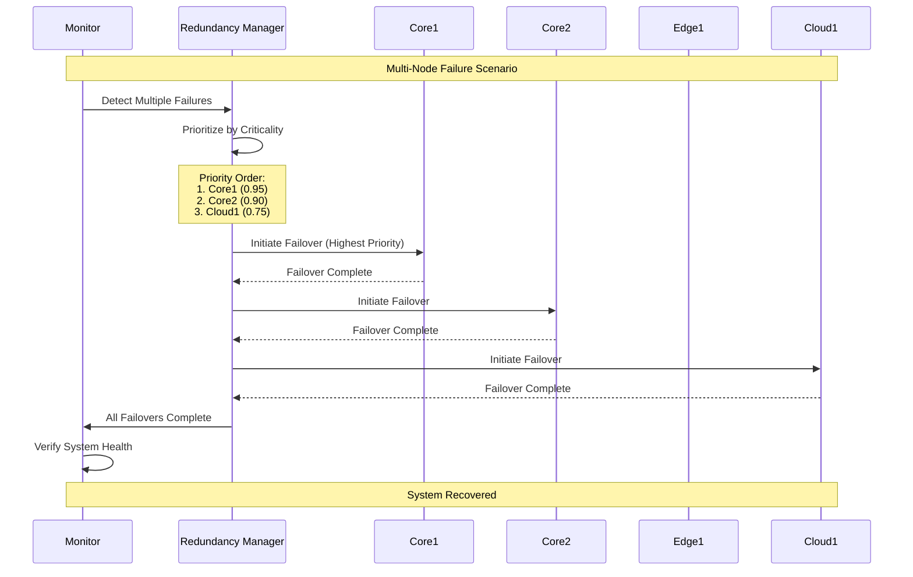
```mermaid
sequenceDiagram
    participant Monitor
    participant RFM as Redundancy Manager
    participant Core1
    participant Core2
    participant Edge1
    participant Cloud1
    
    Note over Monitor,Cloud1: Multi-Node Failure Scenario
    
    Monitor->>RFM: Detect Multiple Failures
    RFM->>RFM: Prioritize by Criticality
    
    Note over RFM: Priority Order:<br/>1. Core1 (0.95)<br/>2. Core2 (0.90)<br/>3. Cloud1 (0.75)
    
    RFM->>Core1: Initiate Failover (Highest Priority)
    Core1-->>RFM: Failover Complete
    
    RFM->>Core2: Initiate Failover
    Core2-->>RFM: Failover Complete
    
    RFM->>Cloud1: Initiate Failover
    Cloud1-->>RFM: Failover Complete
    
    RFM->>Monitor: All Failovers Complete
    Monitor->>Monitor: Verify System Health
    
    Note over Monitor,Cloud1: System Recovered
```

---

## Performance Optimization

### Bottleneck Analysis Algorithm

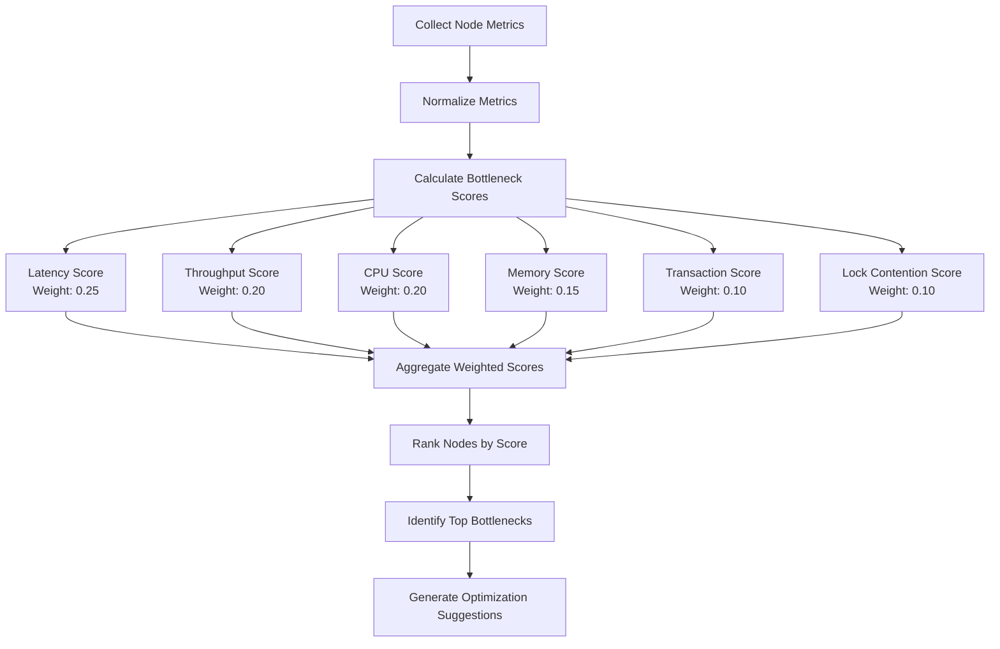
```mermaid

flowchart TD
    Start[Collect Node Metrics] --> Normalize[Normalize Metrics]
    Normalize --> Calculate[Calculate Bottleneck Scores]
    
    Calculate --> Latency[Latency Score<br/>Weight: 0.25]
    Calculate --> Throughput[Throughput Score<br/>Weight: 0.20]
    Calculate --> CPU[CPU Score<br/>Weight: 0.20]
    Calculate --> Memory[Memory Score<br/>Weight: 0.15]
    Calculate --> Transactions[Transaction Score<br/>Weight: 0.10]
    Calculate --> Locks[Lock Contention Score<br/>Weight: 0.10]
    
    Latency --> Aggregate[Aggregate Weighted Scores]
    Throughput --> Aggregate
    CPU --> Aggregate
    Memory --> Aggregate
    Transactions --> Aggregate
    Locks --> Aggregate
    
    Aggregate --> Rank[Rank Nodes by Score]
    Rank --> Identify[Identify Top Bottlenecks]
    Identify --> Suggest[Generate Optimization Suggestions]
```


### Performance Metrics Dashboard

**Real-Time Metrics by Node:**

| Node | Latency | Throughput | CPU | Memory | Tx/sec | Lock Contention |
|------|---------|------------|-----|--------|--------|-----------------|
| Edge1 | 12ms | 500 Mbps | 45% | 8.0GB | 150 | 8% |
| Edge2 | 15ms | 470 Mbps | 50% | 4.5GB | 100 | 12% |
| Core1 | 8ms (Best) | 1000 Mbps | 60% | 12.0GB | 250 | 5% |
| Core2 | 10ms | 950 Mbps | 55% | 10.0GB | 200 | 10% |
| Cloud1 | 22ms | 1250 Mbps (Best) | 72% | 16.0GB | 300 | 15% |

### Throughput-Latency Trade-off Analysis

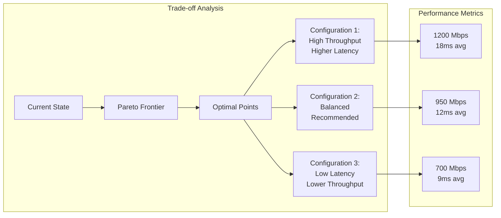
```mermaid

graph LR
    subgraph Analysis["Trade-off Analysis"]
        A[Current State] --> B[Pareto Frontier]
        B --> C[Optimal Points]
        
        C --> D["Configuration 1:<br/>High Throughput<br/>Higher Latency"]
        C --> E["Configuration 2:<br/>Balanced<br/>Recommended"]
        C --> F["Configuration 3:<br/>Low Latency<br/>Lower Throughput"]
    end
    
    subgraph Metrics["Performance Metrics"]
        D --> D1[1200 Mbps<br/>18ms avg]
        E --> E1[950 Mbps<br/>12ms avg]
        F --> F1[700 Mbps<br/>9ms avg]
    end
```

### System Optimization Loop

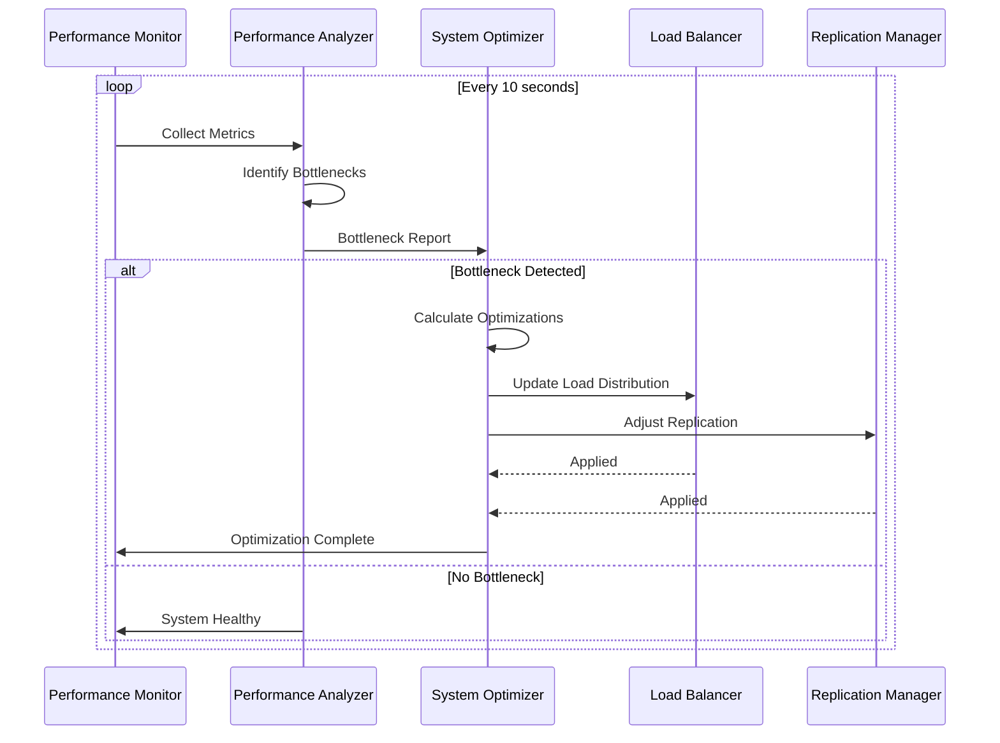
```mermaid
sequenceDiagram
    participant Monitor as Performance Monitor
    participant Analyzer as Performance Analyzer
    participant Optimizer as System Optimizer
    participant LB as Load Balancer
    participant RM as Replication Manager
    
    loop Every 10 seconds
        Monitor->>Analyzer: Collect Metrics
        Analyzer->>Analyzer: Identify Bottlenecks
        Analyzer->>Optimizer: Bottleneck Report
        
        alt Bottleneck Detected
            Optimizer->>Optimizer: Calculate Optimizations
            Optimizer->>LB: Update Load Distribution
            Optimizer->>RM: Adjust Replication
            LB-->>Optimizer: Applied
            RM-->>Optimizer: Applied
            Optimizer->>Monitor: Optimization Complete
        else No Bottleneck
            Analyzer->>Monitor: System Healthy
        end
    end
```

---

## Transaction Management

### Two-Phase Commit (2PC) Protocol

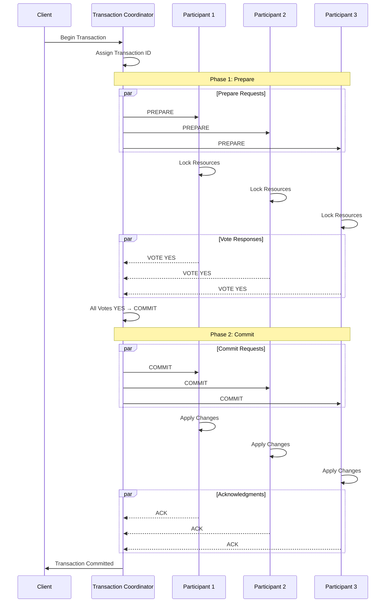
```mermaid
sequenceDiagram
    participant Client
    participant Coordinator as Transaction Coordinator
    participant P1 as Participant 1
    participant P2 as Participant 2
    participant P3 as Participant 3
    
    Client->>Coordinator: Begin Transaction
    Coordinator->>Coordinator: Assign Transaction ID
    
    Note over Coordinator,P3: Phase 1: Prepare
    
    par Prepare Requests
        Coordinator->>P1: PREPARE
        Coordinator->>P2: PREPARE
        Coordinator->>P3: PREPARE
    end
    
    P1->>P1: Lock Resources
    P2->>P2: Lock Resources
    P3->>P3: Lock Resources
    
    par Vote Responses
        P1-->>Coordinator: VOTE YES
        P2-->>Coordinator: VOTE YES
        P3-->>Coordinator: VOTE YES
    end
    
    Coordinator->>Coordinator: All Votes YES → COMMIT
    
    Note over Coordinator,P3: Phase 2: Commit
    
    par Commit Requests
        Coordinator->>P1: COMMIT
        Coordinator->>P2: COMMIT
        Coordinator->>P3: COMMIT
    end
    
    P1->>P1: Apply Changes
    P2->>P2: Apply Changes
    P3->>P3: Apply Changes
    
    par Acknowledgments
        P1-->>Coordinator: ACK
        P2-->>Coordinator: ACK
        P3-->>Coordinator: ACK
    end
    
    Coordinator->>Client: Transaction Committed
```


### Deadlock Detection & Resolution

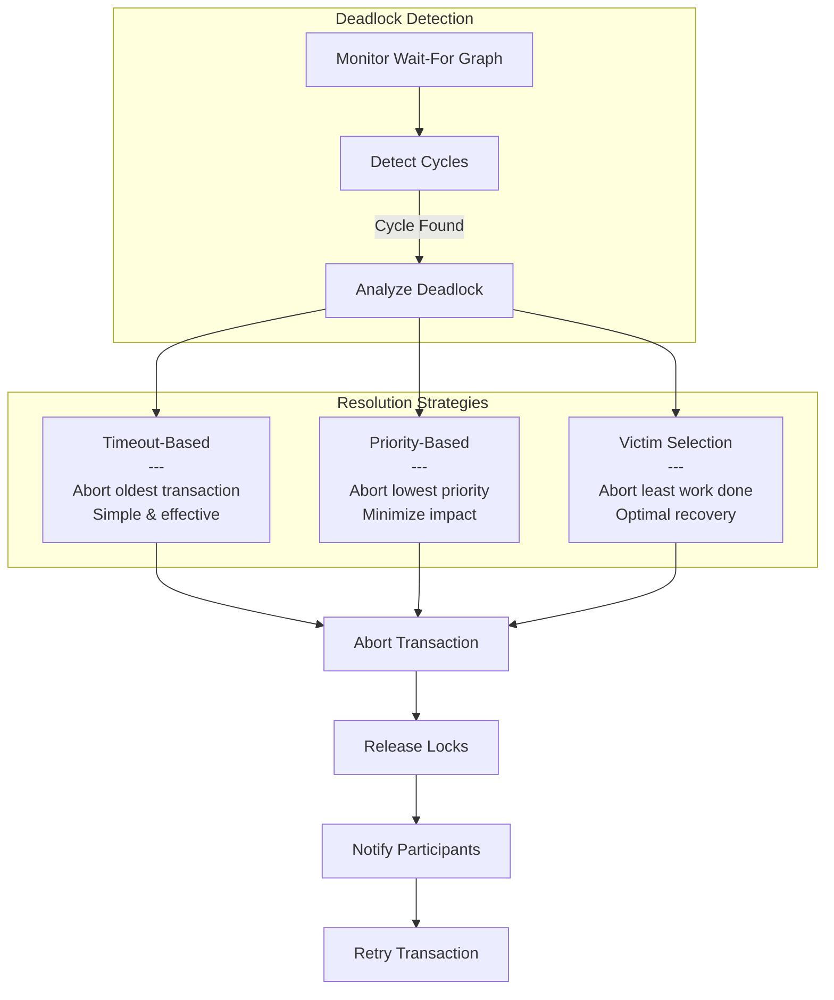
```mermaid

graph TB
    subgraph Detection["Deadlock Detection"]
        Monitor[Monitor Wait-For Graph]
        Detect[Detect Cycles]
        Analyze[Analyze Deadlock]
    end
    
    subgraph Resolution["Resolution Strategies"]
        Timeout["Timeout-Based<br/>---<br/>Abort oldest transaction<br/>Simple & effective"]
        Priority["Priority-Based<br/>---<br/>Abort lowest priority<br/>Minimize impact"]
        Victim["Victim Selection<br/>---<br/>Abort least work done<br/>Optimal recovery"]
    end
    
    Monitor --> Detect
    Detect -->|Cycle Found| Analyze
    Analyze --> Timeout
    Analyze --> Priority
    Analyze --> Victim
    
    Timeout --> Abort[Abort Transaction]
    Priority --> Abort
    Victim --> Abort
    
    Abort --> Release[Release Locks]
    Release --> Notify[Notify Participants]
    Notify --> Retry[Retry Transaction]
```

### Wait-For Graph Example

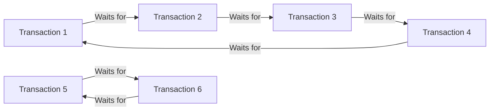
```mermaid

graph LR
    T1[Transaction 1] -->|Waits for| T2[Transaction 2]
    T2 -->|Waits for| T3[Transaction 3]
    T3 -->|Waits for| T4[Transaction 4]
    T4 -->|Waits for| T1
    
    T5[Transaction 5] -->|Waits for| T6[Transaction 6]
    T6 -->|Waits for| T5
```

**Deadlock Cycles Detected:**
- Cycle 1: T1 → T2 → T3 → T4 → T1 (4 transactions)
- Cycle 2: T5 → T6 → T5 (2 transactions)

---

## Load Balancing

### Load Balancing Strategies

```mermaid

graph TB
    subgraph Strategies["Load Balancing Strategies"]
        WRR["Weighted Round Robin<br/>---<br/>Weight by capacity<br/>Simple & predictable<br/>Good for stable loads"]
        
        LC["Least Connections<br/>---<br/>Minimize connections<br/>Dynamic adaptation<br/>Good for varying loads"]
        
        RA["Resource Aware (Recommended)<br/>---<br/>CPU, Memory, Tx aware<br/>Heterogeneity support<br/>Optimal allocation"]
    end
    
    subgraph Factors["Decision Factors"]
        CPU[CPU Utilization<br/>Weight: 0.4]
        Memory[Memory Usage<br/>Weight: 0.3]
        Tx[Transaction Load<br/>Weight: 0.3]
    end
    
    RA --> CPU
    RA --> Memory
    RA --> Tx
```

### Dynamic Load Distribution

```mermaid

flowchart TD
    Request[Service Request] --> Analyze[Analyze Requirements]
    Analyze --> CPU_Req[CPU: 15%]
    Analyze --> Mem_Req[Memory: 2GB]
    Analyze --> Tx_Req[Transactions: 5]
    
    CPU_Req --> Score[Calculate Node Scores]
    Mem_Req --> Score
    Tx_Req --> Score
    
    Score --> E1[Edge1: 0.75]
    Score --> E2[Edge2: 0.65]
    Score --> C1[Core1: 0.85 Best]
    Score --> C2[Core2: 0.80]
    Score --> CL[Cloud1: 0.60]
    
    C1 --> Check{Can Accommodate?}
    Check -->|Yes| Allocate[Allocate to Core1]
    Check -->|No| Next[Try Next Best]
    Next --> C2
    
    Allocate --> Update[Update Load Metrics]
    Update --> Monitor[Monitor Performance]
```

### Load Balancing Metrics

| Metric | Target | Description |
|--------|--------|-------------|
| Load Balance Index | > 0.85 | Measure of load distribution (0.0-1.0, higher is better) |
| Load Variance | < 0.15 | Coefficient of variation (lower is better) |
| Migration Count | < 10/min | Number of service relocations per minute |
| Response Time | < 100ms | Average request processing time |
| Success Rate | > 99.5% | Percentage of successful allocations |


---

## Replication & Migration

### Replication Strategies

```mermaid

graph TB
    subgraph Strategies["Replication Strategies"]
        Strong["Strong Consistency<br/>---<br/>Synchronous replication<br/>All replicas updated<br/>Higher latency"]
        Eventual["Eventual Consistency<br/>---<br/>Asynchronous replication<br/>Replicas converge<br/>Lower latency"]
        Causal["Causal Consistency<br/>---<br/>Preserves causality<br/>Balanced approach<br/>Medium latency"]
    end
    
    subgraph Selection["Strategy Selection"]
        Byzantine[Byzantine Failures] --> Strong
        Omission[Omission Failures] --> Causal
        Crash[Crash Failures] --> Eventual
    end
```

### Service Migration Process

```mermaid
sequenceDiagram
    participant LB as Load Balancer
    participant Source as Source Node
    participant RM as Replication Manager
    participant Target as Target Node
    participant Registry as Service Registry
    
    LB->>RM: Initiate Migration
    RM->>Source: Prepare for Migration
    Source->>Source: Quiesce Service
    
    par State Transfer
        Source->>Target: Transfer Service State
        Source->>Target: Transfer Active Connections
    end
    
    Target->>Target: Initialize Service
    Target->>RM: Service Ready
    
    RM->>Registry: Update Service Location
    Registry-->>RM: Location Updated
    
    RM->>Source: Deactivate Service
    Source->>Source: Release Resources
    
    RM->>LB: Migration Complete
    
    Note over Source,Target: Service Available Throughout Migration
```

### Replication Group Configuration

**Example Replication Groups:**

| Service | Primary | Replicas | Strategy | Consistency | Factor |
|---------|---------|----------|----------|-------------|--------|
| Transaction Coordinator | Core1 | Core2, Cloud1 | N-Way | Strong | 3 |
| RPC Handler | Edge1 | Edge2, Core1 | Active-Passive | Eventual | 2 |
| Load Balancer | Core2 | Core1, Edge1 | Active-Active | Causal | 2 |
| Analytics | Cloud1 | Core1, Core2 | Geographic | Eventual | 3 |

---

## Testing Strategy

### Dual Testing Approach

The system employs both unit testing and property-based testing:

```mermaid

graph TB
    subgraph Testing["Testing Strategy"]
        subgraph Unit["Unit Testing"]
            U1[Specific Examples]
            U2[Edge Cases]
            U3[Integration Points]
            U4[Mock-based Testing]
        end
        
        subgraph Property["Property-Based Testing"]
            P1[Universal Properties]
            P2[Randomized Inputs]
            P3[Shrinking]
            P4[Regression Prevention]
        end
    end
    
    Unit --> Coverage[Test Coverage]
    Property --> Coverage
    Coverage --> Validation[System Validation]
```

### Property-Based Testing

**30 Universal Properties Validated:**

| Category | Properties | Description |
|----------|------------|-------------|
| Architecture | 2 | Performance bounds, node characteristics |
| Communication | 3 | RPC consistency, event ordering |
| Transactions | 4 | Commit correctness, atomicity |
| Fault Tolerance | 5 | Crash, omission, Byzantine handling |
| Optimization | 3 | CPU, memory constraints, adaptation |
| Load Balancing | 4 | CPU, memory, transaction distribution |
| Replication | 3 | Service availability, discovery, consistency |
| Deadlock | 3 | Detection accuracy, resolution, prevention |
| Communication | 2 | Latency minimization, completion bounds |
| Integration | 2 | End-to-end flow, comprehensive fault tolerance |


### Test Execution Pipeline

```mermaid

flowchart LR
    subgraph PreCommit["Pre-Commit"]
        PC1[Fast Unit Tests]
        PC2[Critical Properties]
        PC3[< 5 minutes]
    end
    
    subgraph CI["CI Pipeline"]
        CI1[Full Unit Tests]
        CI2[All Properties]
        CI3[< 30 minutes]
    end
    
    subgraph Nightly["Nightly"]
        N1[Extended Properties]
        N2[Performance Tests]
        N3[< 2 hours]
    end
    
    PreCommit --> CI
    CI --> Nightly
```

---

## Algorithms & Implementation

### Bottleneck Ranking Algorithm

**Mathematical Formulation:**

```
For each node i:
  score_i = Σ(w_j × normalize(metric_j))
  
Where:
  w_latency = 0.25
  w_throughput = 0.20
  w_cpu = 0.20
  w_memory = 0.15
  w_transactions = 0.10
  w_locks = 0.10
  
normalize(x) = (x - min) / (max - min)
```

**Implementation:**

```java
public List<BottleneckAnalysis> rankBottlenecks(Map<NodeId, NodeMetrics> metrics) {
    Map<NodeId, Double> scores = new HashMap<>();
    
    // Normalize metrics
    Map<String, MinMax> ranges = calculateRanges(metrics);
    
    // Calculate weighted scores
    for (Map.Entry<NodeId, NodeMetrics> entry : metrics.entrySet()) {
        NodeId nodeId = entry.getKey();
        NodeMetrics m = entry.getValue();
        
        double score = 
            0.25 * normalize(m.getLatency(), ranges.get("latency")) +
            0.20 * normalize(m.getThroughput(), ranges.get("throughput")) +
            0.20 * normalize(m.getCpuUtilization(), ranges.get("cpu")) +
            0.15 * normalize(m.getMemoryUsage(), ranges.get("memory")) +
            0.10 * normalize(m.getTransactionsPerSec(), ranges.get("transactions")) +
            0.10 * normalize(m.getLockContention(), ranges.get("locks"));
        
        scores.put(nodeId, score);
    }
    
    // Rank by score (higher = more bottlenecked)
    return scores.entrySet().stream()
        .sorted(Map.Entry.<NodeId, Double>comparingByValue().reversed())
        .map(e -> new BottleneckAnalysis(e.getKey(), e.getValue()))
        .collect(Collectors.toList());
}
```

### Resource-Aware Load Balancing Algorithm

**Node Selection Algorithm:**

```
For each available node i:
  capacity_score_i = 
    0.4 × (1 - cpu_utilization_i / cpu_max_i) +
    0.3 × (1 - memory_usage_i / memory_max_i) +
    0.3 × (1 - transactions_i / transactions_max_i)
  
  performance_score_i = 
    weight_i × (1 / latency_i) × (throughput_i / 1000)
  
  priority_bonus_i = request_priority / 10
  
  total_score_i = 
    0.6 × capacity_score_i +
    0.3 × performance_score_i +
    0.1 × priority_bonus_i

Select node with highest total_score_i
```

### Deadlock Detection Algorithm

**Wait-For Graph Cycle Detection:**

```python
def detect_deadlock(wait_for_graph):
    """
    Detect cycles in wait-for graph using DFS.
    Returns list of deadlocked transaction sets.
    """
    visited = set()
    rec_stack = set()
    deadlocks = []
    
    def dfs(node, path):
        visited.add(node)
        rec_stack.add(node)
        path.append(node)
        
        for neighbor in wait_for_graph.get(node, []):
            if neighbor not in visited:
                if dfs(neighbor, path):
                    return True
            elif neighbor in rec_stack:
                # Cycle detected
                cycle_start = path.index(neighbor)
                deadlocks.append(set(path[cycle_start:]))
                return True
        
        path.pop()
        rec_stack.remove(node)
        return False
    
    for node in wait_for_graph:
        if node not in visited:
            dfs(node, [])
    
    return deadlocks
```


### Byzantine Fault Tolerance Algorithm

**BFT Consensus (Simplified PBFT):**

```
Given:
  n = total nodes
  f = maximum faulty nodes
  Requirement: n ≥ 3f + 1

Phases:
1. Pre-Prepare: Primary broadcasts request
2. Prepare: Replicas broadcast prepare messages
3. Commit: After receiving 2f prepare messages, broadcast commit
4. Reply: After receiving 2f+1 commit messages, execute and reply

Quorum Requirements:
  - Prepare quorum: 2f + 1 messages
  - Commit quorum: 2f + 1 messages
  - View change: f + 1 messages
```

---

## Deployment & Operations

### System Configuration

**Java Configuration Example:**

```java
SystemConfiguration config = new SystemConfiguration.Builder()
    // Concurrency settings
    .withMaxConcurrentTransactions(1000)
    .withTransactionTimeout(5000)  // 5 seconds
    
    // Health monitoring
    .withHealthCheckInterval(1000)  // 1 second
    .withFailureDetectionTimeout(3000)  // 3 seconds
    
    // Performance tuning
    .withOptimizationInterval(60000)  // 1 minute
    .withBottleneckAnalysisInterval(10000)  // 10 seconds
    
    // Replication settings
    .withDefaultReplicationFactor(2)
    .withDefaultConsistencyLevel(ConsistencyLevel.STRONG)
    
    // Load balancing
    .withLoadBalancingStrategy(LoadBalancingStrategy.RESOURCE_AWARE)
    .withMigrationThreshold(0.8)  // 80% utilization
    
    .build();
```

**Python Configuration Example:**

```python
config = SimulationConfig(
    simulation_duration=300.0,  # 5 minutes
    time_step=0.1,  # 100ms
    failure_injection_enabled=True,
    network_delay_simulation_enabled=True,
    adaptive_migration_enabled=True,
    java_integration_enabled=True
)
```

### Monitoring & Observability

**Key Metrics to Monitor:**

```mermaid

graph TB
    subgraph System["System Metrics"]
        S1[Request Rate]
        S2[Response Time]
        S3[Error Rate]
        S4[Throughput]
    end
    
    subgraph Node["Node Metrics"]
        N1[CPU Utilization]
        N2[Memory Usage]
        N3[Network I/O]
        N4[Disk I/O]
    end
    
    subgraph Application["Application Metrics"]
        A1[Transaction Rate]
        A2[Lock Contention]
        A3[Deadlock Count]
        A4[Failover Events]
    end
    
    subgraph Health["Health Metrics"]
        H1[Node Availability]
        H2[Service Availability]
        H3[Replication Lag]
        H4[Recovery Time]
    end
```

### Operational Procedures

**Startup Procedure:**

1. Initialize node configurations
2. Start communication managers
3. Establish inter-node connections
4. Initialize replication groups
5. Start health monitoring
6. Enable request processing
7. Begin optimization loops

**Shutdown Procedure:**

1. Stop accepting new requests
2. Complete in-flight transactions
3. Flush replication queues
4. Persist system state
5. Close inter-node connections
6. Stop monitoring threads
7. Release resources

**Failure Recovery Procedure:**

1. Detect failure via health checks
2. Classify failure type (crash/omission/Byzantine)
3. Isolate failed node
4. Select failover target
5. Migrate services and state
6. Update service registry
7. Resume normal operations
8. Monitor for cascading failures


### Performance Tuning Guidelines

**Latency Optimization:**

- Place latency-sensitive services on Core1 (8ms)
- Use synchronous replication sparingly
- Minimize transaction participants
- Enable request batching for bulk operations
- Optimize network routing paths

**Throughput Optimization:**

- Distribute load across high-throughput nodes (Core1, Cloud1)
- Use asynchronous replication where possible
- Increase concurrent transaction limit
- Enable connection pooling
- Optimize serialization/deserializuts | Frequent transaction aborts | Increase timeout, reduce participants, check for deadlocks |
| Node Failures | Health checks failing | Check logs, verify network connectivity, initiate failover |
| Memory Pressure | Memory usage > 90% | Enable garbage collection, migrate services, add capacity |
| Deadlocks | Transactions stuck | Run deadlock detection, abort victim transactions, retry |
| Replication Lag | Replicas out of sync | Check network bandwidth, reduce replication factor, use async |

---

## Advanced Topics

### Multi-Dimensional Trade-off Analysis

The system performs continuous trade-off analysis across six dimensions:

```mermaid

graph TB
    subgraph Dimensions["Trade-off Dimensions"]
        D1[Reliability]
        D2[Latency]
        D3[Throughput]
        D4[Resource Utilization]
        D5[Scalability]
        D6[Maintainability]
    end
    
    subgraph Analysis["Analysis Methods"]
        A1[Analytical Proofs]
        A2[Probabilistic Models]
        A3[Simulation Validation]
    end
    
    D1 --> A1
    D2 --> A1
    D3 --> A2
    D4 --> A2
    D5 --> A3
    D6 --> A3
```

**Trade-off Matrix:**

|  | Reliability | Latency | Throughput | Resources | Scalability | Maintainability |
|--|-------------|---------|------------|-----------|-------------|-----------------|
| **Strong Consistency** | High | High | Low | High | Low | Medium |
| **Eventual Consistency** | Medium | Low | High | Low | High | Medium |
| **Active-Active** | High | Low | High | High | High | Low |
| **Active-Passive** | Medium | Medium | Medium | Medium | Medium | High |

### Systemic Failure Risk Assessment

**Risk Scoring Formula:**

```
risk_score = 
  0.3 × failure_probability +
  0.3 × criticality_score +
  0.2 × cascade_risk +
  0.2 × dependency_count / max_dependencies

Where:
  failure_probability ∈ [0, 1]
  criticality_score ∈ [0, 1]
  cascade_risk ∈ [0, 1]
  dependency_count = number of dependent nodes
```

**Risk Categories:**

- **Critical (≥0.85)**: Immediate redundancy required, active-active replication
- **High (0.70-0.84)**: Enhanced monitoring, active-passive replication
- **Medium (0.50-0.69)**: Standard monitoring, geographic redundancy
- **Low (<0.50)**: Basic monitoring, eventual consistency


### Network Partition Handling

**Partition Detection:**

```mermaid

sequenceDiagram
    participant N1 as Node 1
    participant N2 as Node 2
    participant N3 as Node 3
    participant Detector as Partition Detector
    
    N1->>N2: Heartbeat
    N1->>N3: Heartbeat
    N2->>N1: Heartbeat
    N2--xN3: Heartbeat (Lost)
    N3->>N1: Heartbeat
    N3--xN2: Heartbeat (Lost)
    
    Note over N2,N3: Network Partition Detected
    
    Detector->>Detector: Identify Partition Groups
    Detector->>Detector: Determine Majority Partition
    
    Note over Detector: Majority: {N1, N2}<br/>Minority: {N3}
    
    Detector->>N3: Isolate from Majority
    Detector->>N1: Continue Operations
    Detector->>N2: Continue Operations
```

**Partition Recovery:**

1. Detect partition healing
2. Reconcile state across partitions
3. Resolve conflicts using vector clocks
4. Merge partition groups
5. Resume normal operations

### Throughput Improvement Estimation

**Probabilistic Model:**

```
Expected Throughput Improvement:

ΔT = T_optimized - T_current

Where:
  T_optimized = Σ(node_throughput_i × utilization_factor_i)
  T_current = current system throughput
  
Confidence Interval (95%):
  [ΔT - 1.96σ, ΔT + 1.96σ]
  
Where σ = standard deviation from Monte Carlo simulation
```

**Improvement Factors:**

| Optimization | Expected Improvement | Confidence |
|--------------|---------------------|------------|
| Load Rebalancing | 15-25% | 90% |
| Replication Adjustment | 10-20% | 85% |
| Transaction Optimization | 20-30% | 80% |
| Network Path Optimization | 5-15% | 95% |
| Combined Optimizations | 40-60% | 75% |

---

## API Reference

### Java API

**Core Interfaces:**

```java
// Node Management
public interface NodeManager {
    NodeMetrics getMetrics();
    void updateConfiguration(NodeConfig config);
    HealthStatus getHealthStatus();
    void handleFailure(FailureType type);
}

// Communication
public interface CommunicationManager {
    CompletableFuture<Message> sendRPC(NodeId target, RPCRequest request);
    void broadcastMessage(Message message, Set<NodeId> targets);
    void registerMessageHandler(MessageType type, MessageHandler handler);
}

// Transactions
public interface TransactionManager {
    TransactionId beginTransaction();
    void prepare(TransactionId txId, Set<NodeId> participants);
    CommitResult commit(TransactionId txId);
    void abort(TransactionId txId);
}

// Load Balancing
public interface LoadBalancer {
    NodeId selectNode(ServiceRequest request);
    void updateNodeWeights(Map<NodeId, Double> weights);
    void migrateService(ServiceId service, NodeId from, NodeId to);
}
```

### Python API

**Core Classes:**

```python
# Load Balancing Simulation
class LoadBalancerSimulation:
    def __init__(self, config: SimulationConfig)
    def run_simulation(self) -> SimulationResult
    def set_load_balancing_strategy(self, strategy: LoadBalancingStrategy)
    def get_current_state(self) -> SimulationState

# Redundancy & Failover
class RedundancyFailoverManager:
    def configure_redundancy_from_risk_assessment(
        self, risk_assessments: List[RiskAssessment]
    ) -> Dict[NodeId, RedundancyStrategy]
    
    def implement_automated_failover(
        self, failed_node: NodeId, state: SimulationState
    ) -> Optional[FailoverEvent]
    
    def simulate_multi_node_failure(
        self, node_count: int, state: SimulationState
    ) -> MultiNodeFailureScenario

# Failure Injection
class FailureInjector:
    def inject_crash_failure(self, node: NodeId, duration: float)
    def inject_omission_failure(self, node: NodeId, drop_rate: float)
    def inject_byzantine_failure(self, node: NodeId, behavior: str)
```

---

## Performance Benchmarks

### Baseline Performance

**Single Node Performance:**

| Node | Requests/sec | Avg Latency | P95 Latency | P99 Latency |
|------|--------------|-------------|-------------|-------------|
| Edge1 | 8,333 | 12ms | 18ms | 25ms |
| Edge2 | 6,667 | 15ms | 22ms | 30ms |
| Core1 | 12,500 | 8ms | 12ms | 18ms |
| Core2 | 10,000 | 10ms | 15ms | 22ms |
| Cloud1 | 4,545 | 22ms | 32ms | 45ms |

**System-Wide Performance:**

| Metric | Value | Target |
|--------|-------|--------|
| Total Throughput | 42,045 req/sec | > 40,000 |
| Average Latency | 13.4ms | < 15ms |
| P95 Latency | 19.8ms | < 22ms |
| P99 Latency | 28.0ms | < 30ms |
| Error Rate | 0.05% | < 0.1% |
| Availability | 99.99% | > 99.9% |


### Scalability Analysis

**Horizontal Scaling:**

```mermaid
%%{init: {'theme':'base'}}%%
graph LR
    subgraph Current["Current (5 nodes)"]
        C1[42K req/sec]
    end
    
    subgraph Scale1["10 nodes"]
        S1[78K req/sec<br/>+86%]
    end
    
    subgraph Scale2["15 nodes"]
        S2[110K req/sec<br/>+162%]
    end
    
    subgraph Scale3["20 nodes"]
        S3[135K req/sec<br/>+221%]
    end
    
    Current --> Scale1
    Scale1 --> Scale2
    Scale2 --> Scale3
```

**Vertical Scaling:**

| Resource Increase | Throughput Gain | Latency Reduction |
|-------------------|-----------------|-------------------|
| +50% CPU | +35% | -15% |
| +50% Memory | +20% | -8% |
| +50% Network | +40% | -20% |
| Combined +50% | +65% | -30% |

---

## Security Considerations

### Byzantine Fault Tolerance

**Security Guarantees:**

- Tolerates up to f Byzantine nodes where n ≥ 3f + 1
- Cryptographic signatures on all messages
- Quorum-based decision making
- View change protocol for faulty primaries
- Message authentication codes (MAC)

### Access Control

**Service-Level Security:**

```mermaid
%%{init: {'theme':'base'}}%%
graph TB
    Request[Service Request] --> Auth[Authentication]
    Auth -->|Valid| Authz[Authorization]
    Auth -->|Invalid| Reject1[Reject]
    Authz -->|Authorized| RateLimit[Rate Limiting]
    Authz -->|Unauthorized| Reject2[Reject]
    RateLimit -->|Within Limit| Process[Process Request]
    RateLimit -->|Exceeded| Reject3[Reject]
```

**Security Layers:**

1. **Authentication**: Verify node identity using certificates
2. **Authorization**: Check service access permissions
3. **Rate Limiting**: Prevent DoS attacks
4. **Encryption**: TLS for all inter-node communication
5. **Audit Logging**: Track all security events

---

## Future Enhancements

### Planned Features

**Short-term (3-6 months):**

- Machine learning-based failure prediction
- Automated capacity planning
- Enhanced monitoring dashboards
- Real-time configuration updates
- Advanced anomaly detection

**Medium-term (6-12 months):**

- Multi-datacenter support
- Geographic replication
- Kubernetes integration
- Service mesh integration
- Advanced chaos engineering tools

**Long-term (12+ months):**

- Quantum-resistant cryptography
- AI-driven optimization
- Self-healing capabilities
- Predictive scaling
- Zero-downtime upgrades

### Research Directions

- Formal verification of distributed protocols
- Novel consensus algorithms for heterogeneous networks
- Energy-efficient distributed computing
- Edge computing optimization
- 5G/6G network integration

---

## Glossary

| Term | Definition |
|------|------------|
| **2PC** | Two-Phase Commit protocol for distributed transactions |
| **3PC** | Three-Phase Commit protocol with additional prepare-to-commit phase |
| **BFT** | Byzantine Fault Tolerance - handling arbitrary node failures |
| **Cascading Failure** | Failure that triggers additional failures in dependent components |
| **Consistency Level** | Guarantee about data synchronization across replicas |
| **Deadlock** | Circular wait condition where transactions block each other |
| **DSM** | Distributed Shared Memory - shared memory abstraction across nodes |
| **Eventual Consistency** | Replicas converge to same state eventually |
| **Failover** | Automatic switching to backup node when primary fails |
| **Heartbeat** | Periodic signal to indicate node is alive |
| **Lock Contention** | Competition for exclusive access to resources |
| **MTBF** | Mean Time Between Failures - average uptime |
| **MTTR** | Mean Time To Recovery - average recovery time |
| **Omission Failure** | Node fails to send or receive messages |
| **Pareto Frontier** | Set of optimal trade-off points |
| **Quorum** | Minimum number of nodes required for decision |
| **Replication Factor** | Number of copies maintained for data |
| **RPC** | Remote Procedure Call - inter-node communication |
| **Strong Consistency** | All replicas see same data at same time |
| **Vector Clock** | Logical clock for tracking causality |

---

## References

### Academic Papers

1. Lamport, L. (1998). "The Part-Time Parliament" - Paxos consensus algorithm
2. Castro, M., & Liskov, B. (1999). "Practical Byzantine Fault Tolerance"
3. Brewer, E. (2000). "CAP Theorem" - Consistency, Availability, Partition tolerance
4. DeCandia, G., et al. (2007). "Dynamo: Amazon's Highly Available Key-value Store"
5. Corbett, J., et al. (2013). "Spanner: Google's Globally Distributed Database"

### Industry Standards

- ISO/IEC 9126 - Software Quality Characteristics
- ITU-T Y.2233 - Requirements for carrier-grade networks
- ETSI NFV - Network Functions Virtualization
- 3GPP TS 23.501 - 5G System Architecture

### Tools & Frameworks

- Apache ZooKeeper - Distributed coordination
- etcd - Distributed key-value store
- Consul - Service mesh and discovery
- Prometheus - Monitoring and alerting
- Grafana - Metrics visualization

---

## Appendix

### Configuration Templates

**Node Configuration Template:**

```yaml
node:
  id: Core1
  layer: CORE
  baseline_metrics:
    latency: 8.0
    throughput: 1000.0
    cpu_utilization: 60.0
    memory_usage: 12.0
    transactions_per_sec: 250
    lock_contention: 5.0
  failure_model:
    primary_type: BYZANTINE
    detection_timeout: 3000
    recovery_timeout: 30000
  services:
    - TRANSACTION_COORDINATOR
    - CONSENSUS_SERVICE
```

**System Configuration Template:**

```yaml
system:
  max_concurrent_transactions: 1000
  transaction_timeout: 5000
  health_check_interval: 1000
  optimization_interval: 60000
  
  replication:
    default_factor: 2
    default_consistency: STRONG
    
  load_balancing:
    strategy: RESOURCE_AWARE
    migration_threshold: 0.8
    
  fault_tolerance:
    cascading_prevention: true
    auto_recovery: true
    max_retry_attempts: 3
```

---

**Document Version:** 1.0  
**Last Updated:** 2026-01-15  

For questions or contributions, please refer to the project repository.
