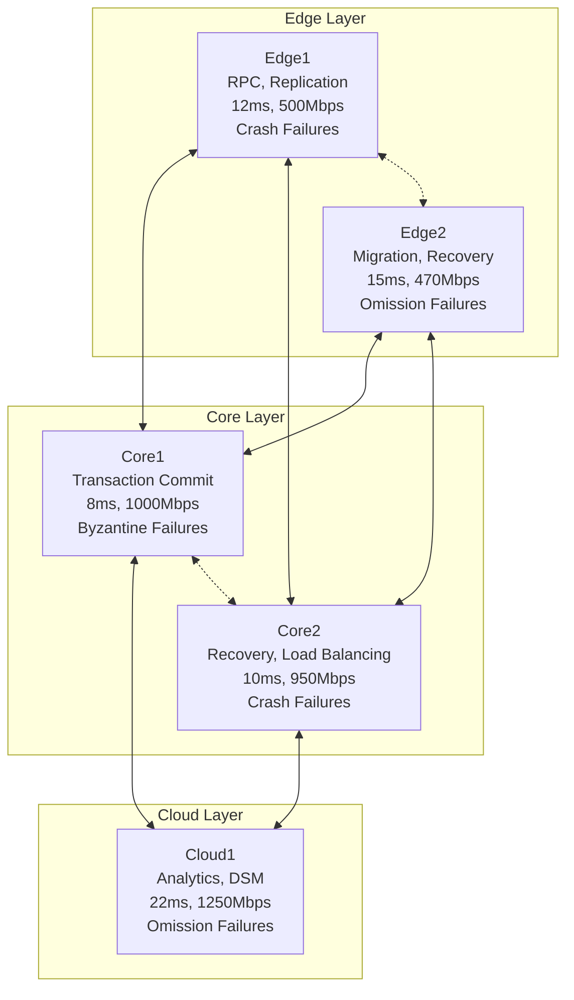
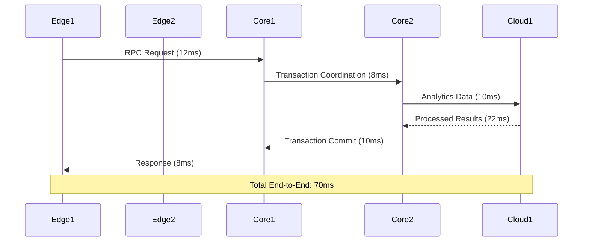

# Design Document: Distributed Telecom System

## Overview

This document presents the design for a carrier-grade edge-core-cloud distributed telecom system that interconnects five heterogeneous nodes across three architectural layers. The system is designed to handle diverse failure modes (crash, omission, Byzantine), optimize performance across multiple dimensions (latency, throughput, resource utilization), and provide strong consistency guarantees under concurrent operations.

The architecture follows a hierarchical distributed model where Edge nodes (Edge1, Edge2) handle user-facing services with low latency requirements, Core nodes (Core1, Core2) manage transaction processing and coordination, and Cloud nodes (Cloud1) provide analytics and distributed shared memory services. The design emphasizes formal optimization, fault tolerance, and measurable performance improvements.

## Architecture

### System Topology

The system implements a three-tier distributed architecture optimized for telecom workloads:



### Service Placement Strategy

**Formal Optimization Criteria:**
- **Latency Minimization**: Place latency-sensitive services on nodes with lowest base latency
- **Throughput Maximization**: Distribute high-bandwidth services across nodes with highest throughput capacity
- **Resource Efficiency**: Balance CPU and memory utilization to prevent bottlenecks
- **Fault Tolerance**: Replicate critical services across nodes with different failure modes

**Service Allocation:**

1. **Edge Layer Services**:
   - **Edge1**: RPC Call handling, Data Replication, Event Ordering
     - Justification: Lowest edge latency (12ms), moderate CPU usage (45%), crash failure mode allows for simple recovery
   - **Edge2**: Migration services, Node Failure Recovery
     - Justification: Handles omission failures well, higher memory (4.5GB) for migration buffers

2. **Core Layer Services**:
   - **Core1**: Transaction Commit, 2PC/3PC coordination
     - Justification: Lowest overall latency (8ms), highest throughput (1000Mbps), Byzantine tolerance for critical transactions
   - **Core2**: Recovery operations, Load Balancing, Deadlock Detection
     - Justification: Good balance of performance and reliability, crash failure mode suitable for recovery services

3. **Cloud Layer Services**:
   - **Cloud1**: Analytics, RPC Call aggregation, Distributed Shared Memory
     - Justification: Highest memory (16GB) and transaction capacity (300 tx/sec), suitable for analytics workloads

### Coordination Mechanisms

**Consensus Protocol Selection:**
- **Byzantine Fault Tolerant (BFT) Consensus** for Core1 (Byzantine failures)
- **Crash Fault Tolerant (CFT) Consensus** for Edge1, Core2 (crash failures)  
- **Omission Fault Tolerant (OFT) Consensus** for Edge2, Cloud1 (omission failures)

**Control Flow Architecture:**


## Components and Interfaces

### Core Components

#### 1. Node Manager
```java
public interface NodeManager {
    NodeMetrics getMetrics();
    void updateConfiguration(NodeConfig config);
    HealthStatus getHealthStatus();
    void handleFailure(FailureType type);
}

public class NodeMetrics {
    private double latency;           // milliseconds
    private double throughput;        // Mbps
    private double packetLoss;        // percentage
    private double cpuUtilization;    // percentage
    private double memoryUsage;       // GB
    private int transactionsPerSec;   // tx/sec
    private double lockContention;    // percentage
}
```

#### 2. Communication Manager
```java
public interface CommunicationManager {
    CompletableFuture<Message> sendRPC(NodeId target, RPCRequest request);
    void broadcastMessage(Message message, Set<NodeId> targets);
    void registerMessageHandler(MessageType type, MessageHandler handler);
    NetworkPartition detectPartition();
}

public class Message {
    private MessageId id;
    private NodeId sender;
    private NodeId receiver;
    private MessageType type;
    private byte[] payload;
    private long timestamp;
    private int priority;
}
```

#### 3. Transaction Manager
```java
public interface TransactionManager {
    TransactionId beginTransaction();
    void prepare(TransactionId txId, Set<NodeId> participants);
    CommitResult commit(TransactionId txId);
    void abort(TransactionId txId);
    void handleDeadlock(Set<TransactionId> deadlockedTxs);
}

public enum CommitResult {
    COMMITTED, ABORTED, TIMEOUT, BYZANTINE_FAILURE
}
```

#### 4. Fault Tolerance Manager
```java
public interface FaultToleranceManager {
    void detectFailure(NodeId node, FailureType type);
    void initiateRecovery(NodeId failedNode);
    void handleByzantineFailure(NodeId suspectedNode, Evidence evidence);
    ReplicationStrategy getReplicationStrategy(ServiceType service);
}

public enum FailureType {
    CRASH, OMISSION, BYZANTINE, NETWORK_PARTITION
}
```

#### 5. Load Balancer
```java
public interface LoadBalancer {
    NodeId selectNode(ServiceRequest request);
    void updateNodeWeights(Map<NodeId, Double> weights);
    void migrateService(ServiceId service, NodeId from, NodeId to);
    LoadBalancingMetrics getMetrics();
}

public class LoadBalancingStrategy {
    public static final String WEIGHTED_ROUND_ROBIN = "weighted_round_robin";
    public static final String LEAST_CONNECTIONS = "least_connections";
    public static final String RESOURCE_AWARE = "resource_aware";
}
```

### Interface Specifications

#### RPC Interface
```java
@RPCService
public interface DistributedService {
    @RPCMethod(timeout = 5000, retries = 3)
    CompletableFuture<Result> processRequest(Request request);
    
    @RPCMethod(timeout = 10000, retries = 1)
    CompletableFuture<Void> replicateData(DataBlock data, ReplicationLevel level);
    
    @RPCMethod(timeout = 2000, retries = 5)
    CompletableFuture<Boolean> healthCheck();
}
```

#### Event Ordering Interface
```java
public interface EventOrderingService {
    void submitEvent(Event event);
    List<Event> getOrderedEvents(long fromTimestamp, long toTimestamp);
    void establishCausalOrder(EventId event, Set<EventId> dependencies);
    LogicalClock getLogicalClock();
}
```

## Data Models

### Node Configuration Model
```java
public class NodeConfiguration {
    private NodeId nodeId;
    private NodeLayer layer;              // EDGE, CORE, CLOUD
    private NodeMetrics baselineMetrics;
    private Set<ServiceType> supportedServices;
    private FailureModel failureModel;
    private ResourceLimits resourceLimits;
    private NetworkTopology networkTopology;
}

public class ResourceLimits {
    private double maxCpuUtilization;     // 0.0 to 1.0
    private double maxMemoryUsage;        // GB
    private int maxConcurrentTransactions;
    private double maxNetworkBandwidth;   // Mbps
}
```

### Transaction Model
```java
public class DistributedTransaction {
    private TransactionId transactionId;
    private Set<NodeId> participants;
    private TransactionState state;
    private long startTimestamp;
    private long timeoutMs;
    private Map<NodeId, PrepareResponse> prepareResponses;
    private Set<ResourceLock> acquiredLocks;
}

public enum TransactionState {
    ACTIVE, PREPARING, PREPARED, COMMITTING, COMMITTED, ABORTING, ABORTED
}
```

### Replication Model
```java
public class ReplicationGroup {
    private GroupId groupId;
    private NodeId primary;
    private Set<NodeId> replicas;
    private ConsistencyLevel consistencyLevel;
    private ReplicationStrategy strategy;
    private int replicationFactor;
}

public enum ConsistencyLevel {
    EVENTUAL, STRONG, CAUSAL, SEQUENTIAL
}
```

### Performance Model
```java
public class PerformanceMetrics {
    private double averageLatency;
    private double p95Latency;
    private double p99Latency;
    private double throughput;
    private double errorRate;
    private double resourceUtilization;
    private long measurementWindow;
}

public class BottleneckAnalysis {
    private NodeId bottleneckNode;
    private BottleneckType type;
    private double severityScore;      // 0.0 to 1.0
    private String description;
    private Set<OptimizationSuggestion> suggestions;
}
```

## Correctness Properties

*A property is a characteristic or behavior that should hold true across all valid executions of a system—essentially, a formal statement about what the system should do. Properties serve as the bridge between human-readable specifications and machine-verifiable correctness guarantees.*

After analyzing the acceptance criteria, I've identified the following properties that can be validated through property-based testing. These properties ensure the system behaves correctly across all possible inputs and scenarios.

### System Architecture and Performance Properties

**Property 1: Performance Bounds Compliance**
*For any* system configuration and workload, the system should maintain latency within 8-22ms range, throughput within 470-1250 Mbps range, and resource utilization within specified bounds for each node type.
**Validates: Requirements 1.4**

**Property 2: Node Characteristics Preservation**
*For any* system initialization, all five nodes (Edge1, Edge2, Core1, Core2, Cloud1) should be present with their correct baseline characteristics from the dataset.
**Validates: Requirements 2.1**

### Communication and Transaction Properties

**Property 3: RPC Round-trip Consistency**
*For any* valid RPC request sent between nodes, the response should be received within the expected latency bounds and contain the correct data.
**Validates: Requirements 2.2**

**Property 4: Transaction Commit Protocol Correctness**
*For any* distributed transaction involving multiple nodes, the 2PC/3PC protocol should ensure atomicity - either all participants commit or all abort.
**Validates: Requirements 2.3, 12.4**

**Property 5: Partial Failure Resilience**
*For any* injected partial failure scenario, the system should continue processing requests correctly on non-failed nodes.
**Validates: Requirements 2.4**

**Property 6: Event Ordering Consistency**
*For any* set of events with defined priorities and causal relationships, the system should order them consistently across all nodes.
**Validates: Requirements 2.5**

### Performance Analysis Properties

**Property 7: Bottleneck Ranking Consistency**
*For any* set of performance metrics from all nodes, the bottleneck ranking algorithm should produce consistent and deterministic rankings.
**Validates: Requirements 3.1**

**Property 8: Comprehensive Metric Analysis**
*For any* performance analysis, all required metrics (latency, throughput, packet loss, CPU/memory, transaction rates, lock contention) should be included in the calculation.
**Validates: Requirements 3.2**

**Property 9: Multi-Node Analysis Completeness**
*For any* performance analysis execution, metrics from all five nodes should be included in the analysis.
**Validates: Requirements 3.4**

### Fault Tolerance Properties

**Property 10: Crash Failure Handling**
*For any* crash failure on Edge1 or Core2, the system should detect the failure and maintain service availability through other nodes.
**Validates: Requirements 4.1**

**Property 11: Omission Failure Handling**
*For any* omission failure on Edge2 or Cloud1, the system should detect missing messages and handle them appropriately.
**Validates: Requirements 4.2**

**Property 12: Byzantine Failure Tolerance**
*For any* Byzantine failure on Core1, the system should maintain correctness despite arbitrary malicious behavior.
**Validates: Requirements 4.3**

**Property 13: Cascading Failure Prevention**
*For any* sequence of cascading failures, the system should prevent complete system collapse by isolating failures.
**Validates: Requirements 4.4**

### Resource Optimization Properties

**Property 14: CPU Constraint Compliance**
*For any* optimization operation, CPU usage should remain within the 45-72% range across all nodes while maximizing throughput.
**Validates: Requirements 5.1**

**Property 15: Memory Constraint Compliance**
*For any* optimization operation, memory usage should remain within the 4.0-16.0 GB range per node while maximizing throughput.
**Validates: Requirements 5.2**

**Property 16: Dynamic Adaptation**
*For any* change in traffic or transaction patterns, the system should adapt its behavior within a reasonable time window.
**Validates: Requirements 5.3**

### Load Balancing Properties

**Property 17: CPU Load Distribution**
*For any* load balancing operation, CPU loads should be distributed across nodes proportional to their capabilities and current utilization.
**Validates: Requirements 7.1**

**Property 18: Memory Load Distribution**
*For any* load balancing operation, memory loads should be distributed appropriately across nodes based on their capacity.
**Validates: Requirements 7.2**

**Property 19: Transaction Load Distribution**
*For any* transaction workload, processing should be distributed across nodes to prevent bottlenecks.
**Validates: Requirements 7.3**

**Property 20: Heterogeneity-Aware Balancing**
*For any* load balancing decision, node heterogeneity and service dependencies should be considered in the allocation.
**Validates: Requirements 7.4**

### Replication and Consistency Properties

**Property 21: Service Availability During Migration**
*For any* service migration operation, the service should remain available to clients throughout the migration process.
**Validates: Requirements 9.2**

**Property 22: Service Discovery Correctness**
*For any* service lookup request, the naming service should return the correct current location of the service.
**Validates: Requirements 9.3**

**Property 23: Strong Consistency Under Concurrency**
*For any* set of concurrent transactions on replicated data, the final state should be equivalent to some sequential execution of those transactions.
**Validates: Requirements 9.4**

### Deadlock and Concurrency Properties

**Property 24: Deadlock Detection Accuracy**
*For any* system state with cyclic wait dependencies, the deadlock detection algorithm should identify all deadlocked transactions.
**Validates: Requirements 13.1**

**Property 25: Deadlock Resolution Effectiveness**
*For any* detected deadlock, the resolution mechanism should break the deadlock while minimizing transaction aborts.
**Validates: Requirements 13.2**

**Property 26: Timeout-Based Deadlock Prevention**
*For any* transaction that exceeds its timeout threshold, the system should abort it to prevent potential deadlocks.
**Validates: Requirements 13.4**

### Communication Optimization Properties

**Property 27: Latency Minimization**
*For any* communication between heterogeneous nodes, the routing should minimize end-to-end latency given network topology.
**Validates: Requirements 14.1**

**Property 28: Transaction Completion Bounds**
*For any* transaction, the completion time should not exceed the calculated upper bound based on system configuration.
**Validates: Requirements 14.3**

### System Integration Properties

**Property 29: End-to-End Data Flow Correctness**
*For any* data flowing through the edge-core-cloud architecture, it should maintain integrity and reach its destination correctly.
**Validates: Requirements 19.2**

**Property 30: Comprehensive Fault Tolerance**
*For any* component failure in the system, fault tolerance mechanisms should activate to maintain overall system availability.
**Validates: Requirements 19.4**

## Error Handling

### Failure Classification and Response

The system implements a comprehensive error handling strategy based on the three primary failure modes present in the dataset:

#### 1. Crash Failures (Edge1, Core2)
- **Detection**: Heartbeat monitoring with 1-second intervals
- **Response**: Immediate failover to backup nodes
- **Recovery**: Automatic restart with state recovery from persistent storage
- **Timeout**: 5-second detection window, 10-second recovery window

#### 2. Omission Failures (Edge2, Cloud1)  
- **Detection**: Message acknowledgment tracking with exponential backoff
- **Response**: Retry with alternative routing paths
- **Recovery**: Gradual reintegration with load shedding
- **Timeout**: 3-retry limit with 2-second intervals

#### 3. Byzantine Failures (Core1)
- **Detection**: Multi-node consensus verification using BFT protocols
- **Response**: Isolation and evidence collection
- **Recovery**: Manual intervention required after forensic analysis
- **Timeout**: 30-second consensus timeout, immediate isolation

### Error Recovery Strategies

#### Graceful Degradation
```java
public class GracefulDegradationManager {
    public ServiceLevel determineServiceLevel(Set<NodeId> availableNodes) {
        if (availableNodes.size() >= 4) return ServiceLevel.FULL;
        if (availableNodes.size() >= 3) return ServiceLevel.REDUCED;
        if (availableNodes.size() >= 2) return ServiceLevel.MINIMAL;
        return ServiceLevel.EMERGENCY;
    }
}
```

#### Circuit Breaker Pattern
- **Closed State**: Normal operation with failure monitoring
- **Open State**: Fast-fail for 30 seconds after 5 consecutive failures  
- **Half-Open State**: Limited traffic to test recovery

#### Compensation Actions
- **Transaction Rollback**: Automated compensation for failed distributed transactions
- **State Reconciliation**: Periodic consistency checks and repair
- **Resource Cleanup**: Automatic cleanup of orphaned resources

## Testing Strategy

### Dual Testing Approach

The system employs both unit testing and property-based testing to ensure comprehensive coverage:

#### Unit Testing
- **Specific Examples**: Test concrete scenarios with known inputs and expected outputs
- **Edge Cases**: Test boundary conditions, empty inputs, and error conditions  
- **Integration Points**: Test component interactions and API contracts
- **Mock-based Testing**: Isolate components for focused testing

#### Property-Based Testing
- **Universal Properties**: Test properties that should hold for all valid inputs
- **Randomized Input Generation**: Generate diverse test cases automatically
- **Shrinking**: Automatically find minimal failing examples
- **Regression Prevention**: Ensure properties continue to hold as code evolves

### Property-Based Testing Configuration

**Framework**: QuickCheck for Java (junit-quickcheck)
**Test Iterations**: Minimum 100 iterations per property test
**Timeout**: 30 seconds per property test
**Shrinking**: Enabled with maximum 100 shrink attempts

**Property Test Tagging Format**:
```java
@Property
@Tag("Feature: distributed-telecom-system, Property 1: Performance Bounds Compliance")
public void testPerformanceBoundsCompliance(@ForAll NodeConfiguration config, 
                                          @ForAll Workload workload) {
    // Test implementation
}
```

### Test Categories

#### 1. Correctness Properties (30 properties)
- System behavior validation across all inputs
- Consistency and safety guarantees
- Fault tolerance verification

#### 2. Performance Properties  
- Latency and throughput bounds
- Resource utilization limits
- Scalability characteristics

#### 3. Integration Properties
- End-to-end workflow validation
- Cross-component interaction testing
- System-wide consistency checks

### Test Data Generation

#### Smart Generators
```java
@Provide
Arbitrary<NodeConfiguration> nodeConfigurations() {
    return Arbitraries.of(
        createEdgeNode(), createCoreNode(), createCloudNode()
    ).map(this::addRealisticConstraints);
}

@Provide  
Arbitrary<FailureScenario> failureScenarios() {
    return Combinators.combine(
        Arbitraries.of(FailureType.values()),
        Arbitraries.integers().between(1, 3),
        Arbitraries.doubles().between(0.0, 1.0)
    ).as(FailureScenario::new);
}
```

#### Constraint-Based Generation
- **Node Characteristics**: Generate within dataset bounds (latency 8-22ms, etc.)
- **Workload Patterns**: Realistic traffic distributions and transaction rates
- **Failure Injection**: Probabilistic failure scenarios based on node failure types
- **Network Conditions**: Variable latency, packet loss, and partitioning scenarios

### Continuous Testing

#### Automated Test Execution
- **Pre-commit**: Fast unit tests and critical properties (< 5 minutes)
- **CI Pipeline**: Full property test suite (< 30 minutes)  
- **Nightly**: Extended property testing with larger iteration counts
- **Performance Regression**: Automated performance benchmarking

#### Test Result Analysis
- **Property Violation Reporting**: Detailed counterexample analysis
- **Performance Trend Monitoring**: Track latency/throughput over time
- **Coverage Analysis**: Ensure all requirements are tested
- **Flaky Test Detection**: Identify and fix non-deterministic test failures